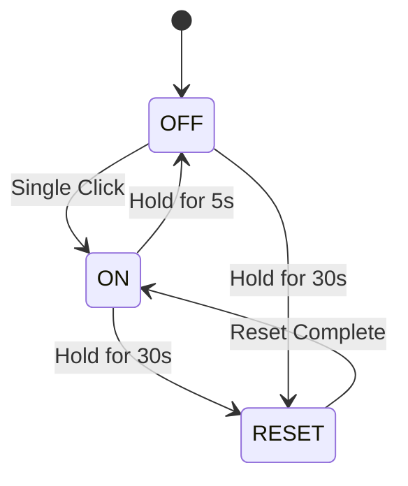
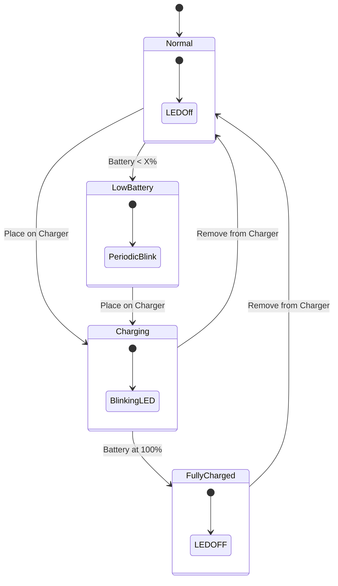
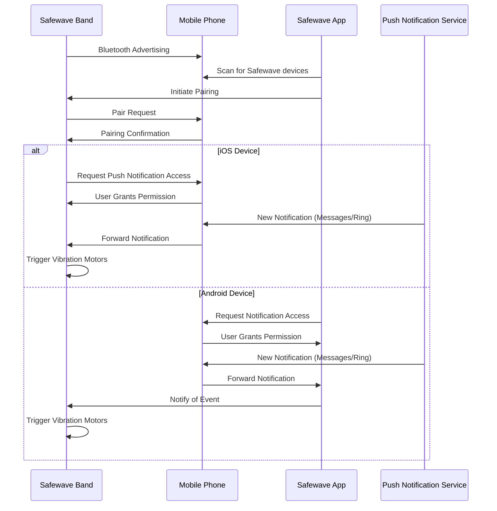
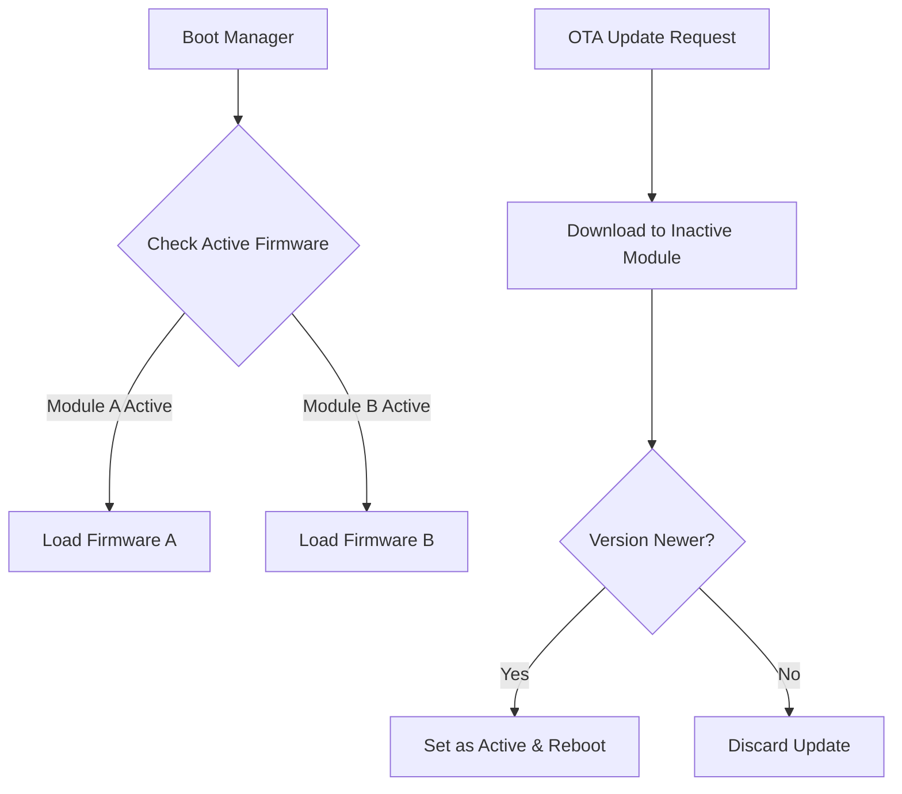

# Safewave Band

## Overview

Safewave Band is a smart wristband device designed to notify users of important notifications through vibration feedback. The band connects to mobile devices via Bluetooth and can be configured to respond to specific app notifications with customizable vibration patterns.

## Hardware Components

- **Vibration Motors** (2): Provides haptic feedback for notifications
- **LED Indicator**: Displays charging status and battery level
- **Button**: Controls power and reset functionality
- **Battery**: Rechargeable battery with low-power indication
- **Bluetooth Module**: Enables communication with mobile devices

## Device States & Button Functionality

| Action              | Result                                     |
| ------------------- | ------------------------------------------ |
| Single Click        | Turn ON (vibrates twice if previously OFF) |
| Hold for 5 seconds  | Turn OFF (vibrates once)                   |
| Hold for 30 seconds | Reset device (see reset functionality)     |

### Power States Explained

When the band is turned OFF:
Band disconnects from phone, but I am not sure on the details of what is actually going on with the device modules.

When the band is turned ON:
Band automatically turns on and sshould start listening to notificaions.

### Reset Functionality

When the band is reset, the following occurs:
Not sure what exactly happens but the device name is reset and the app settings are set to the default ones.

## LED Indicator

| LED State         | Meaning                                       |
| ----------------- | --------------------------------------------- |
| OFF               | Band is on and battery normal                 |
| Blinking          | Band is charging                              |
| Periodic Blinking | Battery low (<X% not sure exactly what it is) |
| OFF               | Battery fully charged                         |

## Mobile Connectivity & Notification Process

## Notification Configuration

The band can be configured to respond to specific app notifications with customized vibration patterns:

### Vibration Pattern Customization

- **Number of Vibrations**: How many consecutive vibrations occur (1-10)
- **Strength of Vibrations**: Intensity level (0-100)
- **Duration of Vibration**: Length of each vibration in milliseconds (50-1000ms)
- **Interval Between Vibrations**: Time between consecutive vibrations (50-1000ms)

Default configurations are set for:

- Apple Messages app (2 vibrations at 50% I think)
- Ring doorbell notifications (not exactly sure what it is)

## Bluetooth Protocols

### Protocol Details

1. **AppSettings Protocol**: Configures which apps trigger notifications and how the band should respond
2. **Naming Protocol**: Gets and sets the name of the band
3. **Battery Protocol**: Retrieves battery level and charging status information I think it is also responsible for firmware version
4. **Direct Vibration Protocol**: Allows direct control of the motors for testing or custom alerts
5. **OTA Protocol**: Manages over-the-air firmware updates

## Firmware Architecture & OTA Updates

The band implements an A/B firmware update mechanism:

- Current active firmware runs from either slot A or B
- OTA updates are downloaded to the inactive slot
- If update is successful and version is newer, the boot manager switches the active slot
- This provides failsafe fallback if an update is corrupted or fails

## Technical Implementation Details

### Firmware Components

- **Main Control Logic**: Implemented in proj_main.c, handling the core event loop
- **Button Control**: Processed in app_key.c with debounce and multi-click detection
- **Motor Control**: PWM-based control in app_pwm.c with configurable patterns
- **Battery Management**: ADC readings in app_adc.c with voltage-to-percentage conversion
- **LED Control**: Direct GPIO manipulation with pattern generation for status indication
- **BLE Stack**: Custom BLE profiles with GATT services for notification and control

### Apple Notification Center Service (ANCS) Implementation

- The band implements an ANCS client to receive iOS notifications
- Notification filtering happens on the band by comparing app IDs
- Support for notification categories including:
  - Messages
  - Incoming calls
  - Missed calls
  - Social media
  - Email

### Power Management

- Idle timer (idleCnt) tracks inactivity to trigger sleep mode
- BLE connection parameters are dynamically adjusted to balance responsiveness and power consumption
- Deep sleep mode disables most peripherals while maintaining minimal wake-up capability
- Button presses and charging events can wake the device from sleep

## Known Issues and Troubleshooting

### Issue 1: Notification Service Interruption

**Symptoms**: Band stops responding to notifications after extended use and on reconnection the Allow notificaitons popup does not appear. ANCS subscription may be lost or iOS notification permissions revoked
**Troubleshooting**:

- Reset the band (hold button for 30 seconds) -> Does not resolve it
- Forget the device in Bluetooth settings and reconnect -> Does not resolve it
- Reset the iPhone (this has been observed to resolve the issue)

### Issue 2: Reconnection Discovery Problem

**Symptoms**: When the band is already connected to the phone, it doesn't appear as discoverable in the app
**Cause**: Due to Apple policies, the app needs to specify the services when connecting to an already-connected device, but the band doesn't advertise itself in this state so we can't disover it
**Technical Cause**: The band's BLE implementation doesn't properly handle advertising while connected. According to the code, once connected to the phone, the band stops advertising its services, making it invisible to the app.
**Workaround**: Disconnect the band from Bluetooth settings before opening the app

### Issue 3: Complete Device Unresponsiveness

**Symptoms**: Very rarely, the band becomes completely unresponsive (no button functionality, no LED, no vibration)
**Technical Cause**: Possible watchdog timer failure or deep software lockup where normal reset mechanisms are bypassed
